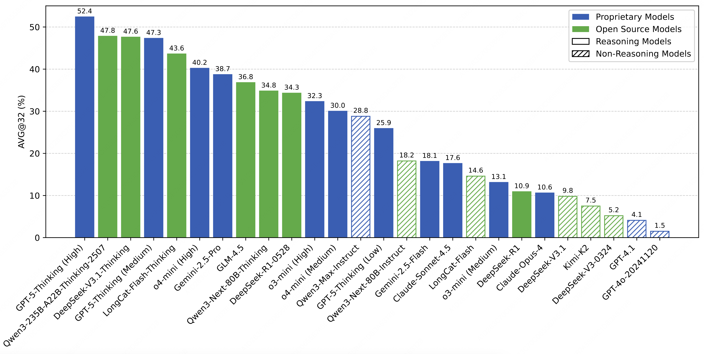
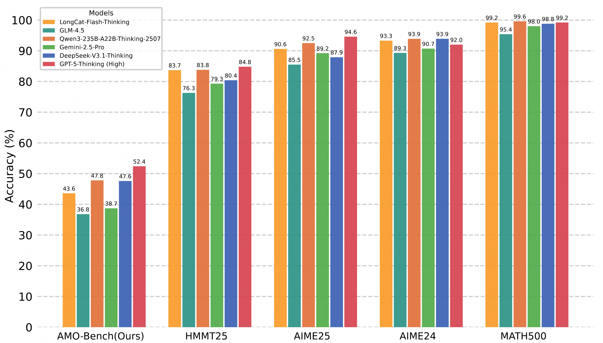
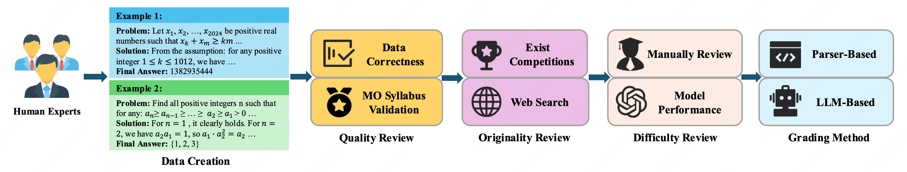

<div align=center><h1>
    📐 AMO-Bench: Large Language Models Still<br>
    Struggle in High School Math Competitions
</h1></div>

<p align="center">
  📃 <a href="https://arxiv.org/abs/2510.26768" target="_blank">Paper</a > • 🌐 <a href="https://amo-bench.github.io/" target="_blank">Project Page</a > • 🤗 <a href="https://huggingface.co/datasets/meituan-longcat/AMO-Bench" target="_blank">Dataset</a ><br>
</p >

This is the official repo for the paper **AMO-Bench: Large Language Models Still Struggle in High School Math Competitions**.


## Updates
- 2025.11.19: **[Kimi-K2-Thinking](https://moonshotai.github.io/Kimi-K2/thinking.html) achieves 56.0%, new SOTA on [Leaderboard](#-leaderboard)!**
- 2025.11.05: The problem statement of **Problem 35** has been revised in <a href="https://huggingface.co/datasets/meituan-longcat/AMO-Bench" target="_blank">🤗 Huggingface Dataset</a >: (1) the five integers that sum to $k$ should be **non-negative** rather than positive, and (2) we also stipulate that 1 couldn't be replaced with five integers. Additionally, for the strictly positive case in the original problem statement, the correct answer should be 7656 (see this [discussion](https://huggingface.co/datasets/meituan-longcat/AMO-Bench/discussions/4) for details). Thanks to the feedback from [@applesilicon](https://huggingface.co/datasets/meituan-longcat/AMO-Bench/discussions/4)!
- 2025.10.31: We release the dataset, evaluation code, and technical report of AMO-Bench.

## 📊 Leaderboard

<p align="center">
    
    <br>
</p>

## 📖 Abstract

We present **AMO-Bench**, an **A**dvanced **M**athematical reasoning benchmark with **O**lympiad
level or even higher difficulty, comprising 50 human-crafted problems.
Existing benchmarks have widely leveraged high school math competitions for evaluating mathematical
reasoning capabilities of large language models (LLMs).
However, many existing math competitions are becoming less effective for assessing top-tier LLMs due to performance saturation (e.g., AIME24/25).
To address this, AMO-Bench introduces more rigorous challenges by ensuring all 50 problems are (1) cross-validated by experts to meet at least the International Mathematical Olympiad (IMO) difficulty standards, and (2) entirely original problems to prevent potential performance leakages from data memorization.
Moreover, each problem in AMO-Bench requires only a final answer rather than a proof, enabling automatic and robust grading for evaluation.

<p align="center">
    
    <br>
</p>

## ⭐ Key Features

<p align="center">
    
    <br>
</p>

- **Original problems.** To prevent performance leaks from existing resources as much as possible,
all problems in AMO-Bench are newly crafted by human experts. Moreover, we conduct a
secondary verification to ensure that there are no highly similar problems in existing competitions
or online resources.
- **Guaranteed difficulty.** Each problem has undergone rigorous cross-validation by multiple
experts to ensure it meets at least the difficulty standards of IMO. We also incorporate an
LLM-based difficulty filtering stage to exclude questions that do not present sufficient challenge
to current reasoning models.
- **Final-answer based grading.** Each problem in AMO-Bench requires a final answer rather than
a full proof, enabling efficient automatic grading. For each problem, we employ a parser-based
or LLM-based grading method according to its answer type, balancing the grading cost and
generalizability.
- **Human-annotated reasoning paths.** In addition to the final answer, each problem also includes
a detailed reasoning path written by human experts. These additional annotations enhance
solution transparency and could support further explorations on AMO-Bench, such as prompt
engineering and error analysis.


## 🛠️ Quick Start

### Installation

1. Clone the repository:
```bash
git clone https://github.com/meituan-longcat/AMO-Bench.git
cd AMO-Bench
```

2. Install dependencies:
```bash
pip install -r requirements.txt
```

### Running evaluations

#### Step 1: Format Model Response File

After obtaining model responses, format them as follows (one JSON object per line):
```data
{"question_id": 1, "model_response": "..."}
{"question_id": 2, "model_response": "..."}
...
```
Save this file in the `./model_responses/` directory.

#### Step 2: Grading Responses
Set your API key and URL in lines 13-14 of `utils.py`.
Then run:
```bash
python grading.py --response_file example.jsonl
```
Evaluation results will be saved under the  `./grading_results/` directory.

#### Step 3 (Optional): Grade on AMO-Bench-P Subset

For a quick evaluation using only the parser-based subset (39 problems), run:
```bash
python grading.py --response_file example.jsonl --only_parser True
```

## Discussions and Feedbacks
Here we summarize the discussions and feedbacks on AMO-Bench from the open-source community.
We will regularly update the dataset to address urgent data issues.

We welcome any feedback you may have!
- Problem 26 appears to be effectively the same as an existing contest problem. Thanks to [@applesilicon](https://huggingface.co/datasets/meituan-longcat/AMO-Bench/discussions/3) to point this out!
- The problem statement for Problem 35 should be further clarified: (1) the five integers that sum to $k$ should be **non-negative** rather than positive, and (2) we also stipulate that 1 couldn't be replaced with five integers. Additionally, for the strictly positive case in the original problem statement, the correct answer should be 7656 (see this [discussion](https://huggingface.co/datasets/meituan-longcat/AMO-Bench/discussions/4) for details). Thanks to the suggestions from [@applesilicon](https://huggingface.co/datasets/meituan-longcat/AMO-Bench/discussions/4)!
- Four problems involve complex numerical expressions (Problem 12, 13, 15 and 21). When tackling these problems, LLMs may struggle to perform accurate calculations without calling external tools. Thanks to the feedback from [@prnake](https://github.com/meituan-longcat/AMO-Bench/issues/1)!
- Problem 38 & 39 appear to be similar in content to two arXiv papers [[1]](https://arxiv.org/pdf/2508.19413) [[2]](https://arxiv.org/pdf/2508.03927).


## 🔎 Citation

If you find our work helpful or relevant to your research, please kindly cite our paper:

```
@misc{an2025amobench,
      title={AMO-Bench: Large Language Models Still Struggle in High School Math Competitions}, 
      author={Shengnan An and Xunliang Cai and Xuezhi Cao and Xiaoyu Li and Yehao Lin and Junlin Liu and Xinxuan Lv and Dan Ma and Xuanlin Wang and Ziwen Wang and Shuang Zhou},
      year={2025},
      eprint={2510.26768},
      archivePrefix={arXiv},
      primaryClass={cs.CL},
      url={https://arxiv.org/abs/2510.26768}, 
}
```

## 🤗 Acknowledgement

The evaluation script utilizes [Math-Verify](https://github.com/huggingface/Math-Verify) to parse and verify model outputs.
We greatly appreciate the contributors' efforts in providing this valuable tool.

## 📜 License

This project is licensed under the MIT License - see the [LICENSE](./LICENSE) file for details.

## 📪 Support

For questions and support, please open an issue on GitHub or contact the maintainers.
